# Создание персонажа и способностей

Пайплайн разработки
-
1. Записать жесты в VR (скорее всего, этот шаг уже выполнен)
2. [Создаем персонажа](#создаем-персонажа) - модель, аватары, пивоты, привязка к компонентам
3. Создаем оружие - добавляем логику, крутим параметры, добавляем к персонажу
4. Тестим у себя на пк
    - Отображается ок?
    - Механики удобные?
5. Тестим в VR 
    - Отображается ок?
    - Есть особенности хендтрекинга, перемещения, восприятия?
6. Тестим в мультиплеере 
    - Как отображается у других? 
    - Работают ли кооп-механики (нерфы/баффы и т.д.)
7. Снимаем видос в очках (меньше одной минуты), на котором должно быть: 
    1. Появление жеста
    2. Использование оружия
    3. Нанесение урона по врагу
    4. Появление этого же жеста у врага
    5. Использование оружия
    6. Нанесение урона по нам

# Создаем персонажа

Добро пожаловать, мне кажется, в самое удобное создание персонажа в игре. Благодаря [CharacterCreatorWindow](../assets/Scripts/Static/CharacterCreatorWindow.cs) мы можем создать …. барабанная дробь … Character Creator Window!

    

        
Находится это добро по пути <strong>Tools -> CharacterCreator</strong>

    

    

        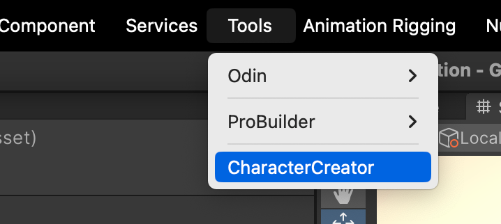
       

    

        
Итак, внутри этого окна есть необходимые поля - <strong> Character Name</strong> - имя персонажа типа PascalCase без нижних подчеркиваний. Например AngerGrief.
<strong>CharacterModel</strong> - нужно подробно разобрать здесь. 
    

    

        
       

    

        <strong>Weapons</strong> - здесь вы можете добавить любые виды оружий. У вас могут быть не готовы скрипты логики/дизайна, это ок, можно добавить их и позже. Главное - напишите имена всех оружий, так создадутся необходимые директории (Resources/Weapons/ИмяОружия/) и префабы.
    

    

        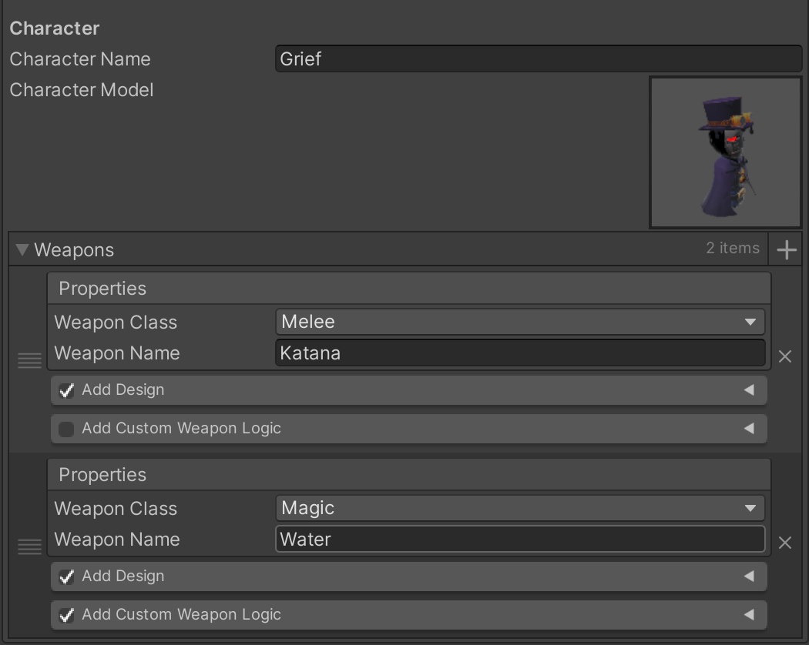
       

Теперь разберемся с [WeaponDesign](../assets/scripts/components/WeaponDesign.cs) и [WeaponLogic](../assets/scripts/Weapons/Weapon.cs). Первый и главный вопрос - зачем мы это разделили на два отдельных компонента. Ответ - чтобы у пользователей была возможность изменять дизайн оружия, добавлять партиклы, эффекты, анимации and so on, но при этом они никак не могли изменить поведение оружия, тем самым отменяя возможность ставить 99999 урона и читерить. Другими словами - WeaponDesign - фронт способности, WeaponLogic - его бэк.
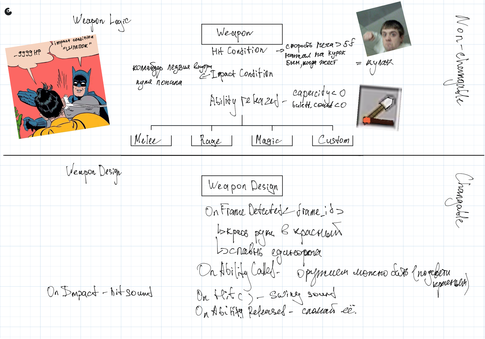

Внутри класса Weapon есть вариант условий (Conditions) которые вам необходимо будет описать. Оружие срабатывает по логике - `onAbilityCalled` → `onHitCondition` → `onImpactCondition`, или говоря русским языком - Когда игрок скастовал все жесты (onAbilityCalled), смотрим, когда вызовется условия возможности ударить (OnHitCondition) (допустим, катана набрала скорость/мы нажали на курок) и после этого проверяем условие на нанесение урона (onImpactCondition) - допустим, когда лезвие вошло в коллайдер противника. Получается так, что нам необходимо описать данные условия один раз у каждого типа оружия. Далее мы можем их наследовать и не заморачиваться с описанием тех же параметров (Например, Melee->onImpactCondition = коллайдер лезвия внутри врага, а Hammer->onImpactCondition = человек попал в область рядом с ударом, однако остальное осталось прежним)

Стоит отметить, что Weapon Design имеет превосходный компонент [ResourcesProcessor](../assets/Scripts/components/ResourcesProcessor.cs). С ними вы подробнее познакомитесь в части автоматизации, т.к. он может буквально брать ресурсы из чата Resources в Tелеграме (а ведь туда могут скидывать и по 40 файлов всяких звуков и вфксов на каждого персонажа) и автоматически сортировать по папкам, логически добавляя их на персонажа.

Итак, последняя деталь - это [HandAppearance Config](../assets/scripts/characters/HandAppearance.cs). Тут вы выбираете 3 главных цвета персонажа и по ним компилятор соберет визуал для рук. (Самая волшебная вещь - у нас не создается дополнительных материалов => батчинг везде одинаковый. На сцене присутствуют 10 материалов рук (для команды 5*5) - настройки которых мы можем динамически изменять благодаря конфигу).

    

        
Выбираем цвета и жмем Create

    

    

        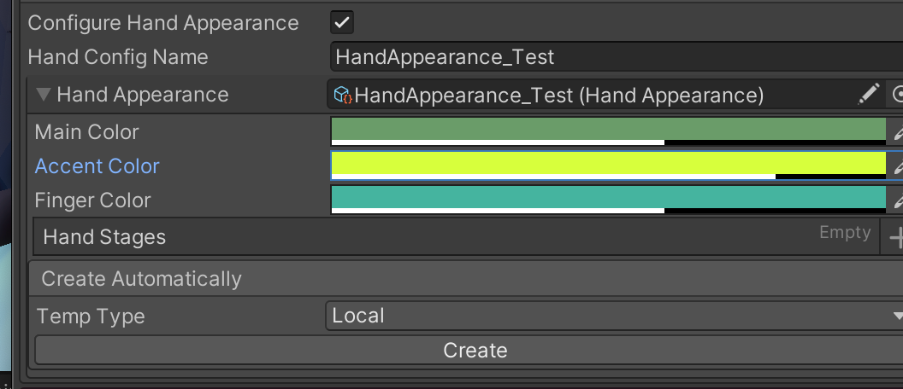
       

 

    

        
Magic!

    

    

        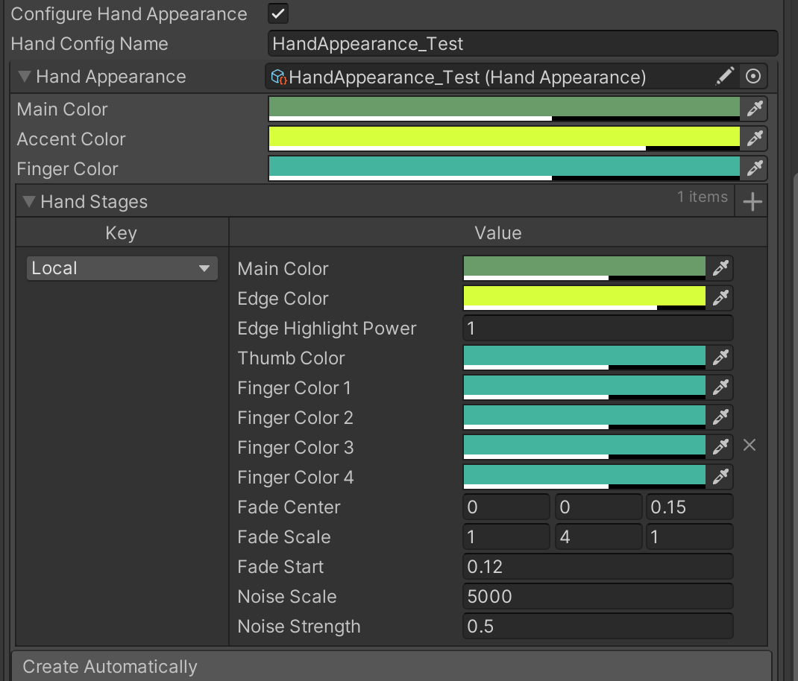
       

        

        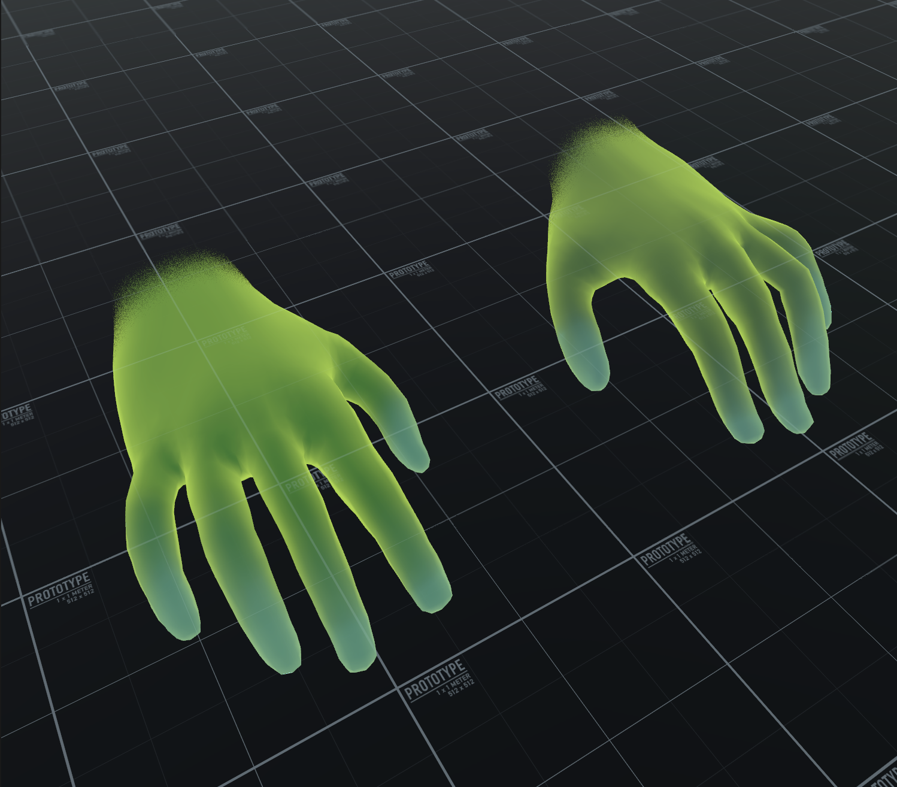
       

Также мы можем настраивать разные варианты отображения на разных аватаров.

    

        
Допустим, local будет дружелюбным

    

    

        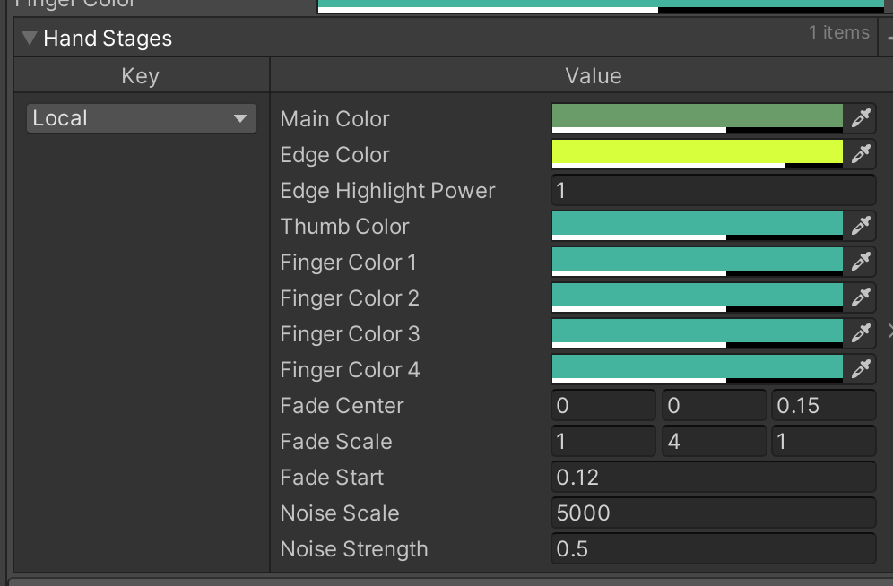
       

         

        
       

    

        
A Enemy - более агрессивным

    

    

        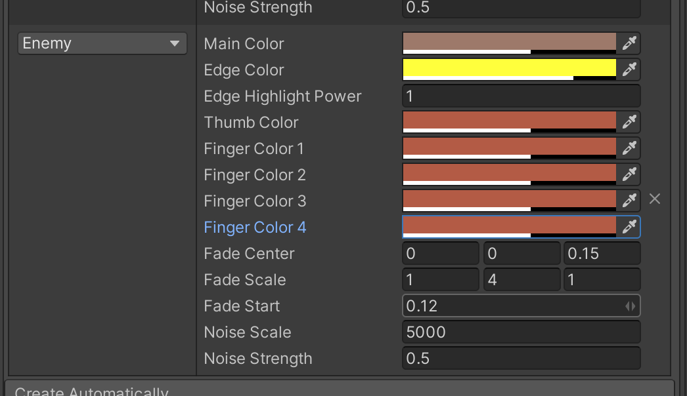
       

         

        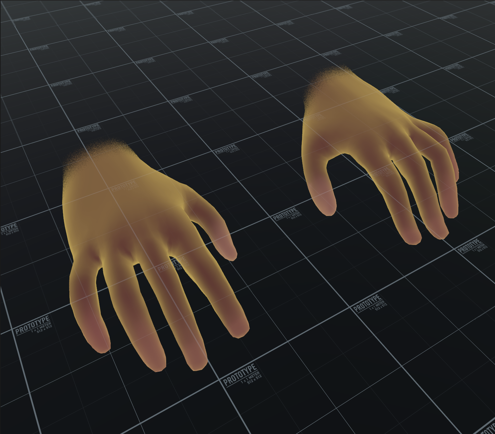
       

    

        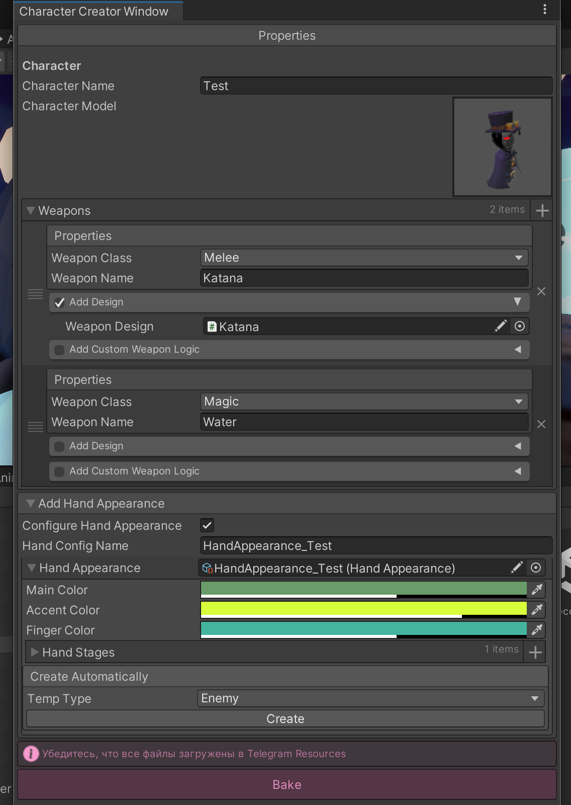
       

    
Ну и когда готово - жмем <strong>Bake</strong>

    

        
Вы можете посмотреть на созданного персонажа в папке Resources/Characters/ИмяПерсонажа

    

    

        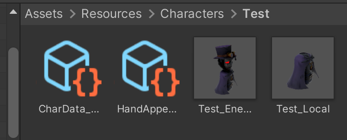
       

    

        
SrciptableObject CharData_ИмяПерсонажа должен выглядеть примерно так

    

    

        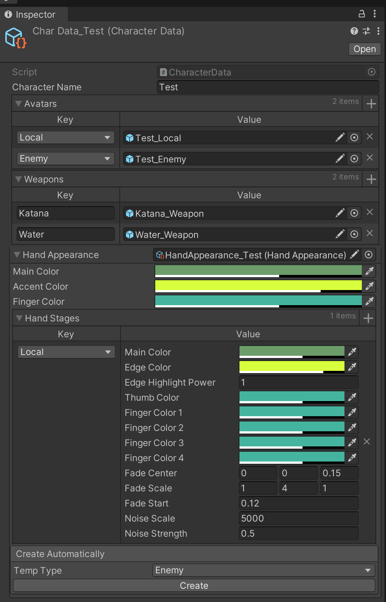
       

    

        
Последнее, что осталось сделать - убедиться, что ваш персонаж добавился в CharacterConfigs по пути Prefabs/Managers/CharacterController

    

    

        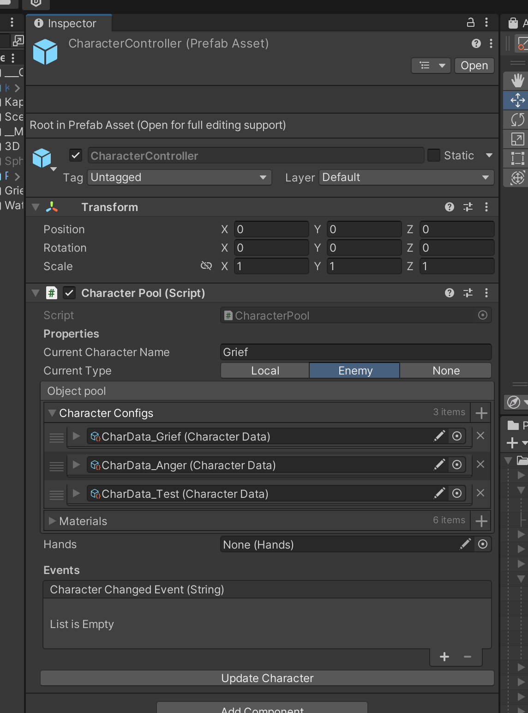
       

# Ставим пивоты у персонажа

