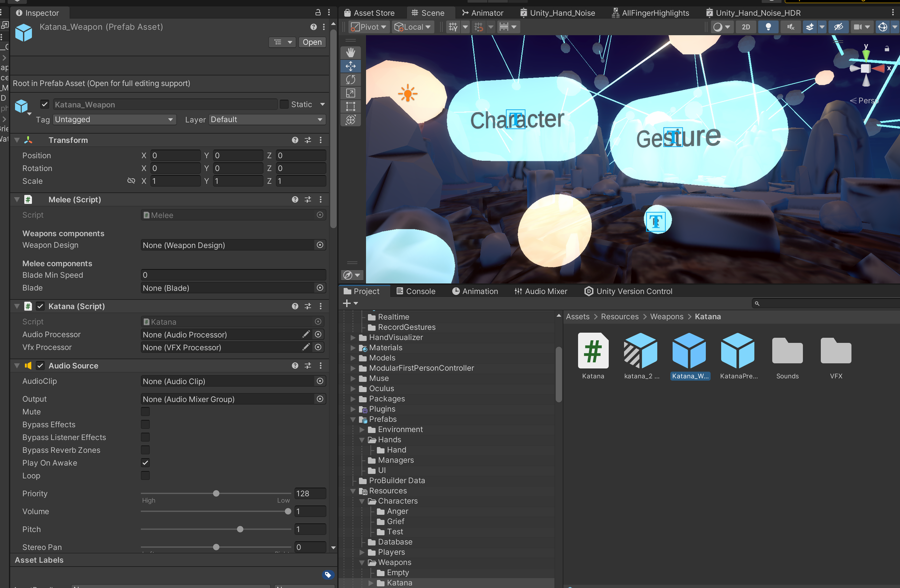

Character And Abilities Creating
Добро пожаловать, мне кажется, в самое удобное создание персонажа в игре. Благодаря [CharacterCreatorWindow](../assets/Scripts/Static/CharacterCreatorWindow.cs) мы можем создать …. барабанная дробь … Character Creator Window!

    

        
Находится это добро по пути <strong>Tools -> CharacterCreator</strong>

    

    

        
       

    

        
Итак, внутри этого окна есть необходимые поля - <strong> Character Name</strong> - имя персонажа типа PascalCase без нижних подчеркиваний. Например AngerGrief.
<strong>CharacterModel</strong> - нужно подробно разобрать здесь. 
    

    

        
       

    

        <strong>Weapons</strong> - здесь вы можете добавить любые виды оружий (самое главное, на любой стадии готовности, т.е. без дизайна/логики, c скриптом, но без методов или с ними. Самое главное - у вас автоматически создадутся и подтянутся все префабы оружий, добавятся к игроку и вручную ничего прокидывать не придется.
    

    

        
       

Теперь разберемся с [WeaponDesign](../assets/scripts/components/WeaponDesign.cs) и [WeaponLogic](../assets/scripts/Weapons/Weapon.cs). Первый и главный вопрос - зачем мы это разделили на два отдельных компонента. Ответ - чтобы у пользователей была возможность изменять дизайн оружия, добавлять партиклы, эффекты, анимации and so on, но при этом они никак не могли изменить поведение оружия, тем самым отменяя возможность ставить 99999 урона и читерить. Другими словами - WeaponDesign - фронт способности, WeaponLogic - его бэк.

Внутри класса Weapon есть вариант условий (Conditions) которые вам необходимо будет описать. Оружие срабатывает по логике - onAbilityCalled → onHitCondition → onImpactCondition, или говоря русским языком - Когда игрок скастовал все жесты, смотрим, когда вызовется условия возможности ударить (допустим, катана набрала скорость или мы нажали на курок) и после этого условия проверяем условие на нанесение урона - допустим, когда лезвие вошло в коллайдер противника.

Стоит отметить, что Weapon Design имеет превосходный компонент [ResourcesProcessor](../assets/Scripts/components/ResourcesProcessor.cs). С ними вы подробнее познакомитесь в части автоматизации, т.к. он может буквально брать ресурсы из чата Resources в телеграме (а ведь туда могут скидывать и по 40 файлов всяких звуков и вфксов на каждого персонажа) и автоматически сортировать по папкам, логически добавляя их на персонажа.

Итак, последняя деталь - это [HandAppearance Config](../assets/scripts/characters/HandAppearance.cs). Тут вы выбираете 3 главных цвета персонажа и по ним компилятор соберет визуал для рук. (Самая волшебная вещь - у нас не создается дополнительных материалов => батчинг везде одинаковый. На сцене присутствуют 10 материалов рук (для команды 5*5) - настройки которых мы можем динамически изменять благодаря конфигу).

    

        
Выбираем цвета и жмем Create

    

    

        
       

 

    

        
Magic

    

    

        
       

Также мы можем настраивать разные варианты отображения на разных аватаров.

    

        
Допустим, local будет дружелюбным

    

    

        
       

    

        
A Enemy - более агрессивным

    

    

        
       

    

        
       

    
Ну и когда готово - жмем <strong>Bake</strong>

Вы можете посмотреть на созданного персонажа в папке Resources/Characters/ИмяПерсонажа:

