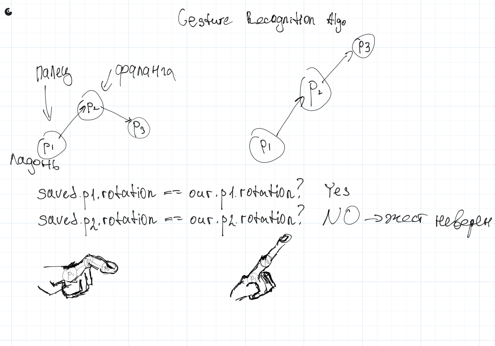
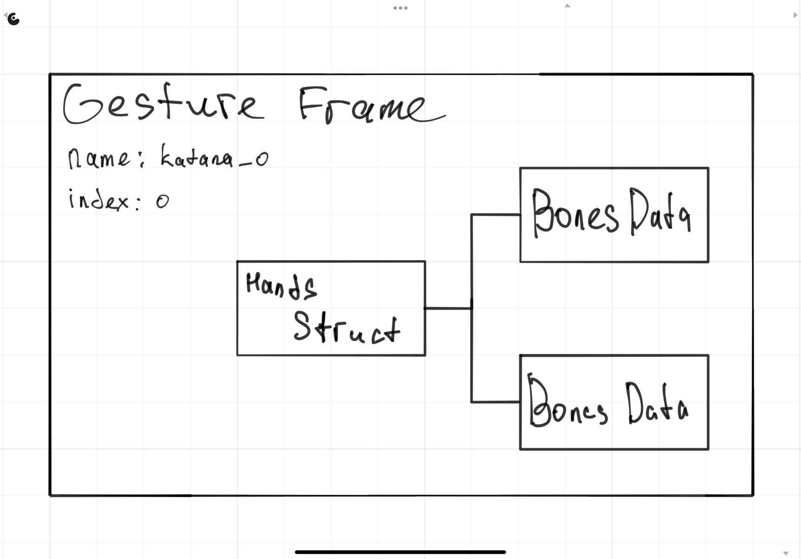
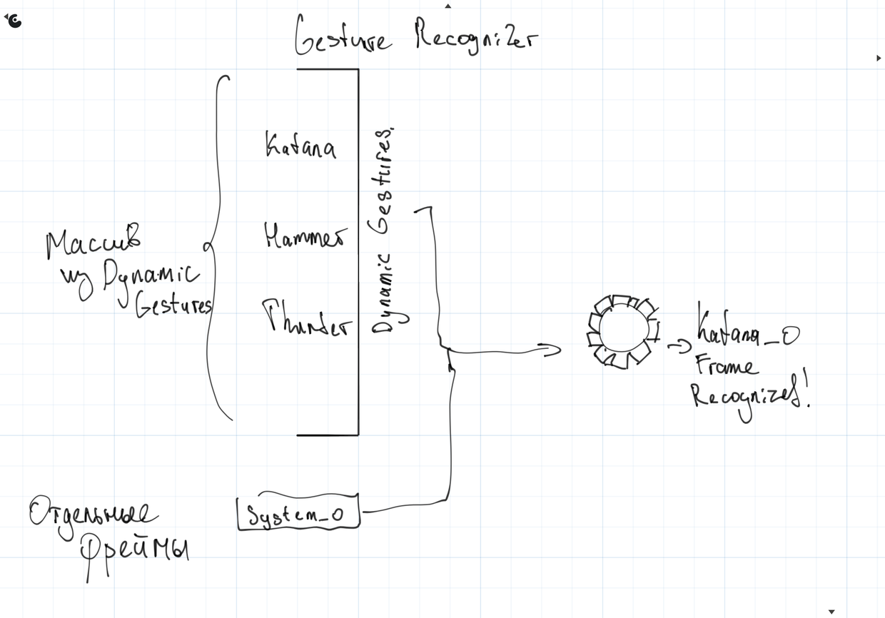
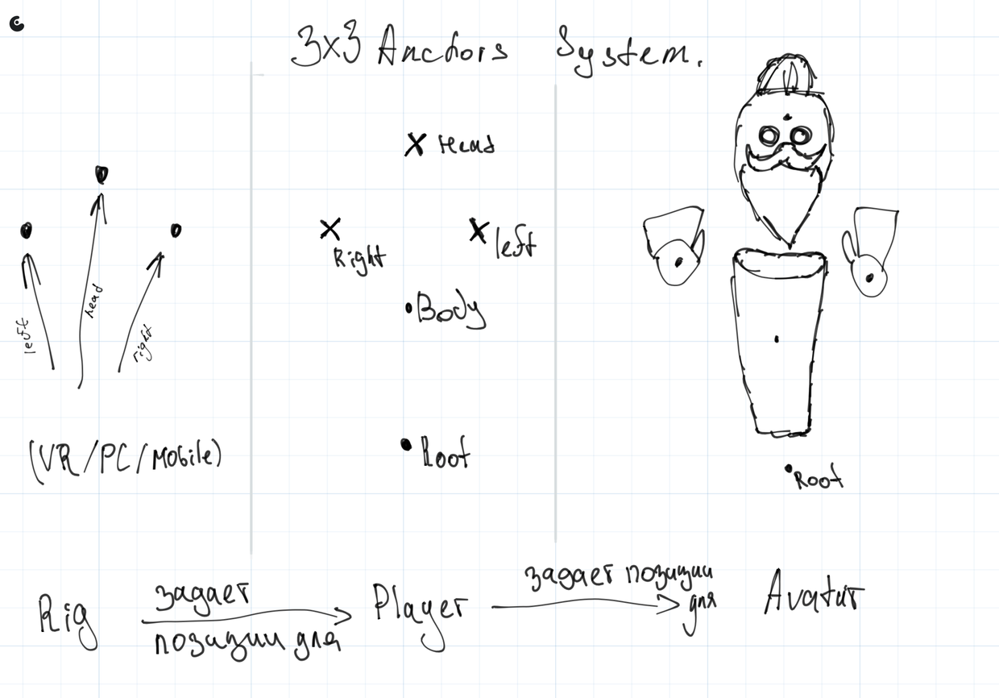
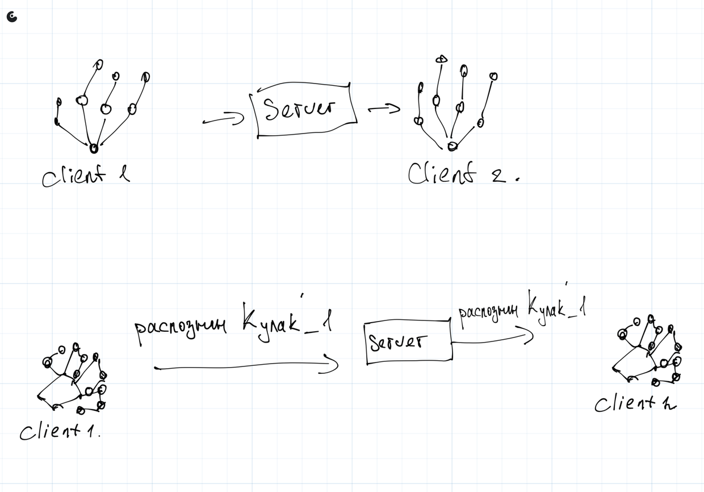
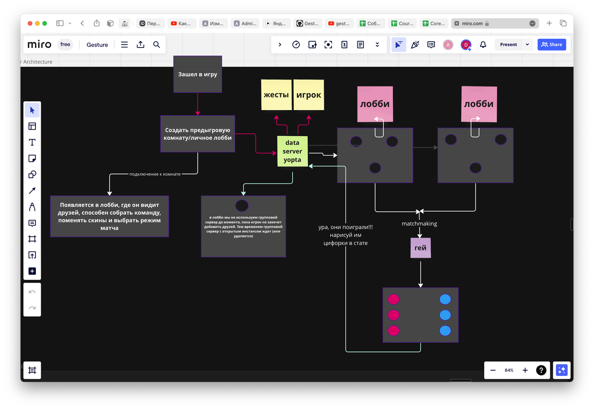

Весь код проекта можно разделить на 3 отдельные категории -
 - Gesture recognition process

 - Player - character - ability manipulation

 - Multiplayer

## Gesture recognition process

Распознавание жестов происходит по принципу сравнения расстояний до точек -

Соответсвенно, для сохранения одного жеста (будем называть их фреймами) нам нужно записать rotations всех его костей. При этом, если мы хотим добавить соблюдение расположения фрейма (игрок должен показать жест в конкретном месте (допустим, над головой)) нам не нужно запоминать расположение всех 26 точек (общее колличество считываемых костей в одной руке), а достаточно всего лишь запомнить одну позицию Root кости.

Класс [BonesData](../Assets/Scripts/HandsLogic/BonesData.cs) как раз описывает эту структуру.

Комбинация из двух рук - [HandsStruct](../Assets/Scripts/Gestures/GestureFrame.cs) будет использоваться в большинстве дальнейших вычислений (хранение фреймов в базе, распознавание, промежуточная синхронизация и т.д.). Она же включена в [GestureFrame](../Assets/Scripts/Gestures/GestureFrame.cs), который добавляет необходимую информацию для хранения.

Теперь можно перейти к динамическим жестам. По сути, [DynamicGesture](../Assets/Scripts/Gestures/DynamicGesture.cs) можно представлять как анимацию из фреймов, которую игрок должен проиграть самостоятельно.

Ну и соответсвенно, [Recognizer](../Assets/Scripts/Gestures/Compilers/Recognition/Recognizer.cs) отвечает за распознавание жестов. На вход могут подаваться массивы из жестов, а также отдельные фреймы (для обработки [условий взаимодействия оружий](../Assets/Scripts/Weapons/Weapon.cs)).

Каждый динамический жест хранит свой IRecognizable класс, который ответственен за логику - что должно произойти, когда сработал определенный фрейм (Показать оружие/ изменить цвет руки/ проиграть звук/vfx или заспавнить огромного механического единорога, который будет кидаться апельсинами во врагов).

## Player - Character - Ability manipulation

Для того, чтобы понять, что тут происходит, нужно понять, какие цели мы преследуем. Нам нужно создать префаб, который способен:

Поддерживать разные типы ввода (от шлема и джойстиков, клавиатуры, телефона, микроволновки)

Поддерживать разные типы персонажей и разные состояния у этих персонажей - умерший Гнев, вражеский Восторг, локальная Грусть и т.д.

Иметь возможность оптимизировано синхронизировать данные между разными устройствами.

Соответсвенно, решение - использовать 3 разных компонента -  Rig, Player и Avatar (краткий отступ – аватар мы получаем через CharacterPool → Character, состояние которого меняется в зависимости от запросов сервера или playerа).

В итоге, у нас получается такая цепочка взаимодействий.

Если у нас присутсвует риг (именно мы управляем персонажем), позиции PlayerAnchors постоянно обновляются

Независимо от рига, анкоры аватара всегда привязаны к PlayerAnchors.

А что-же делать с синхронизацией позиций рук? Тут все просто. Вместо того, чтобы каждый кадр обновлять позиции всех 52 костей, мы будем синхронизировать позиции 2х Root костей каждой руки и изменять жесты только если они были распознаны рекогнайзером.

Теперь следует перейти в форму представления Character. Так как каждый персонаж имеет уникальные магические способности, все IRecognizables (помните их, да) хранятся в нем. Допустим, есть IRecognizable Hammer и оно будет принадлежать персонажу Anger. Следовательно, при запуске игры, recognizer будет распознавать только этот жест, экономя ресурсы платформы. Как и было указано ранее, все персонажи (в режиме эдитора их конфиги) хранятся в CharacterPool и инициализируются один раз за всю игру.

## Multiplayer

Тут проще начать от целого к частному. Мы можем представить работу мультиплеера как совокупность из 2х серверов -

Spring boot (в нашем случае - data server yopta), который способен принимать и обрабатывать входящие запросы о статистике игрока, доступных жестах и др. Однако, в данный момент я все больше и больше склоняюсь к cloud save, в которой эти моменты уже автоматизированы и ускорены. (В дальнейшем вам придется часто взаимодействовать с cloud save для взаимодействия с gesture recorderом, так что базовую структуру с Player/Game data нужно понимать).

Мы используем Server Game Hosting от unity, поскольку там удобно работать с активными сессионками, pvp и деплоем. Соответсвенно, вместе с ним фреймворк Netcode for GameObjects.

Общий порядок игры у нас такой (вновь обращаемся к схеме) - Заходим в игру, появляемся в пре-лобби, в котором у нас есть 3 кнопки для перехода по режимам. Gesture Editor, Gesture Sandbox, Gesture Classic. В данной схеме у нас описана логика классики. Мы

Подключаемся на сцену (пока игрок находится локально и подключен только к data server yopta)

Игрок может выбрать добавиться в пати и в этом случае он либо (являясь хостом) остается на своей карте, к нему добавляются друзья. Либо он в качестве друга добавляется к хостам. При этом всем мы не тратим ресурсы на хостинг, так как это происходит исключительно засчет производительности хоста (ПОКА НАХОДИТСЯ В РАЗРАБОТКЕ)

Независимо от этого, при клике на кнопку Play, игроки через матчмейкер подключаются к игровому серверу. Соответсвенно, там происходит основной соревновательный процесс. (ПОКА НАХОДИТСЯ В РАЗРАБОТКЕ)

При завершении игры статистика передается в data server yopta и происходит обмен хостами (если хост пати решит выйти, а остальные остаться) (ПОКА НАХОДИТСЯ В РАЗРАБОТКЕ). 

 

 