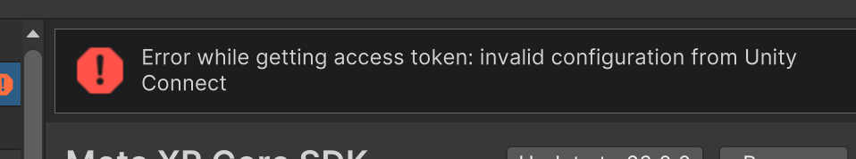

# Get Started

First, we'll install the project and pull up everything we need.

And we need to:

- Unity 2022.3.2 LTS
- Modules:
    - Android Build Support
    - Linux Dedicated Server Build Support
    - Build for your OS with L2TP support, in my case it is Mac Build Support IL2CPP.

And also add to Git, Mirror and Unity Cloud Services (write to me @dimasik057 in person and send your guide/unity/miro account, I will send collaborations).

After that, you can proceed to importing the Gesture_TYPE project from the repository

### Troubleshooting.

You may have a number of errors after importing. You can deal with them by reinstalling the [Odin Plugin](https://drive.google.com/file/d/1l2FogxZCO3kcP6VRp8Lni-lg1l_N13Ua/view?usp=drive_link)
.

It is also possible to see this error. Just ignore it, because it connected with Meta Organization geographic limitations.

The next step is - [Analysis of the project architecture](ProjectArchitecture.md)