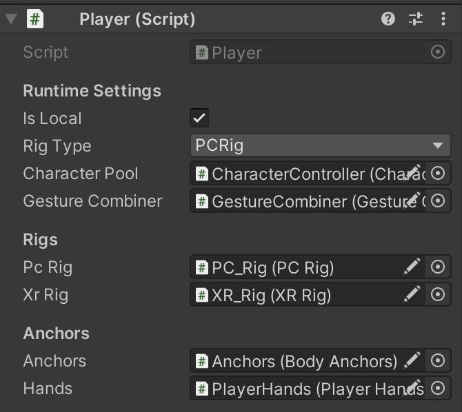
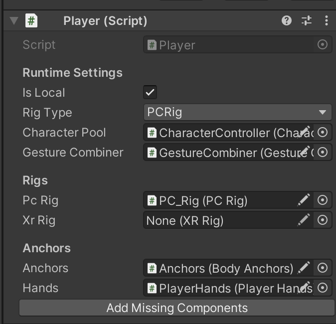

### Components
# Smart Component

### Overview

[`SmartComponent`](../assets/scripts/Components/SmartComponent.cs) is an abstract class designed to extend Unity's MonoBehaviour functionality, it helps to automate the process of adding dependeces of component. It inherits from `SerializedMonoBehaviour`, allowing it to be serialized and managed by Unity's editor.

### Key Features

- **Abstract Property**: `shouldAddMissingComponents` - An abstract property that determines whether the component should attempt to add missing components. This property must be implemented by any class that extends `SmartComponent`.
- **Conditional Button in Unity Editor**: A button labeled "Add Missing Components" is conditionally shown in the Unity Editor based on the value of `shouldAddMissingComponents`. This button triggers the `CallAddMissingComponents` method.
- **Method for Adding Missing Components**: `AddMissingComponents` - A virtual method that can be overridden by subclasses to implement custom logic for adding missing components. By default, it does nothing.

Using SmartComponent will help you effectively add all dependencies in one click, encapsulating the complex search process. It's **fast**, **convenient**, and allows you to use the component **without thinking** about dependencies. Also, prefabs in unity have the property of untying components when overrriding a prefab. `SmartComponent` will help here too.

### Usage

To use `SmartComponent`, you must extend it in your own class and implement the `shouldAddMissingComponents` property. 
<div style="display: flex; align-items: center;">
    <div style="flex: 1; text-align: center; ">
        For example, here you have complex dependeces of the component
    </div>
    <div style="flex: 1; display: flex; flex-direction: column; align-items: flex-end;">
        
    </div>
</div>
<p></p>
<div style="display: flex; align-items: center;">
    <div style="flex: 1; text-align: center; ">
    If any of the dependencies are missing, the <strong>AddMissingComponents</strong>  button is displayed. If you click on it, all dependencies will be added to the component again
    </div>
    <div style="flex: 1; display: flex; flex-direction: column; align-items: flex-end;">
        
    </div>
</div>

We just describe the condition:
``` c#
  protected override bool shouldAddMissingComponents =>
            !(_characterPool && _anchors && _hands && _pcRig && _xrRig && _gestureCombiner);
```
And `AddMissingComponents` function
``` c#
  public override void AddMissingComponents()
        {
            _characterPool = GetComponentInChildren<CharacterPool>();

            _anchors = transform.Find("Anchors").GetComponent<BodyAnchors>();
            _anchors.AddMissingComponents(); // you can call this function recursively

            _hands = _anchors.transform.GetComponentInChildren<PlayerHands>();
            _pcRig = transform.Find("PC_Rig").GetComponent<PCRig>();
            _pcRig.AddMissingComponents();
            _xrRig = transform.Find("XR_Rig").GetComponent<XRRig>();
            _xrRig.AddMissingComponents();
            _gestureCombiner = transform.Find("GestureCombiner").GetComponent<GestureCombiner>();
        }

```