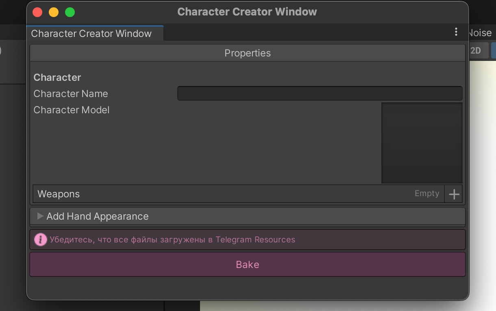

# Создание персонажа и способностей

Пайплайн разработки
-
1. Записать жесты в VR (скорее всего, этот шаг уже выполнен)
2. [Создаем персонажа](#создаем-персонажа) - модель, аватары, пивоты, привязка к компонентам
3. Создаем оружие - добавляем логику, крутим параметры, добавляем к персонажу
4. Тестим у себя на пк
    - Отображается ок?
    - Механики удобные?
5. Тестим в VR 
    - Отображается ок?
    - Есть особенности хендтрекинга, перемещения, восприятия?
6. Тестим в мультиплеере 
    - Как отображается у других? 
    - Работают ли кооп-механики (нерфы/баффы и т.д.)
7. Снимаем видос в очках (меньше одной минуты), на котором должно быть: 
    1. Появление жеста
    2. Использование оружия
    3. Нанесение урона по врагу
    4. Появление этого же жеста у врага
    5. Использование оружия
    6. Нанесение урона по нам

# Создаем персонажа

Добро пожаловать, мне кажется, в самое удобное создание персонажа в игре. Благодаря [CharacterCreatorWindow](../assets/Scripts/Static/CharacterCreatorWindow.cs) мы можем создать …. барабанная дробь … Character Creator Window!

    

        
Находится это добро по пути Tools -> CharacterCreator

    

    

        
       

    

        
Итак, внутри этого окна есть необходимые поля - <strong> Character Name</strong> - имя персонажа типа PascalCase без нижних подчеркиваний. Например AngerGrief.
<strong>CharacterModel</strong> - нужно подробно разобрать здесь. 

    

    

        
       

